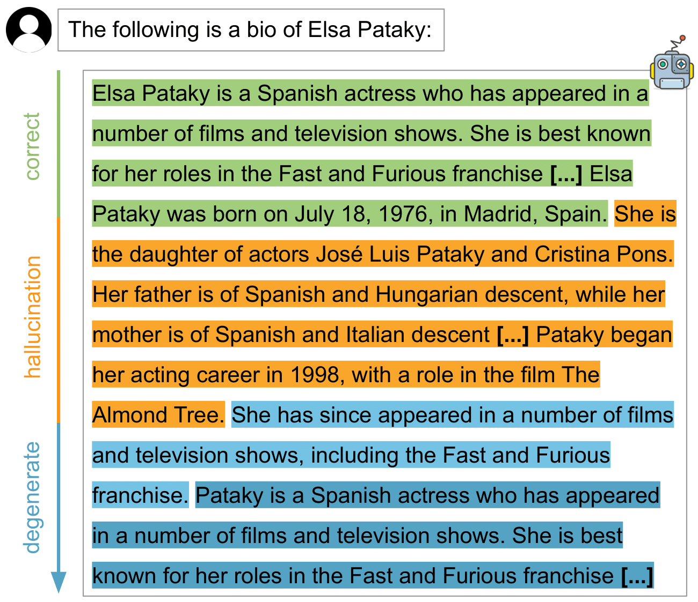

# From Loops to Oops: Fallback Behaviors of Language Models Under Uncertainty
This is the official repository for the paper [From Loops to Oops: Fallback Behaviors of Language Models Under 
Uncertainty](https://arxiv.org/abs/2407.06071). Our research investigates undesirable behaviors in large language models (LLMs), such as hallucinations 
and sequence repetitions, identifying them as fallback mechanisms under uncertainty. We found that as models become 
more advanced, they shift towards more complex fallback behaviors.

This repository provides the code and data needed to reproduce the results described in the paper.
For details about our experiments and findings using Llama 2 and 3, OLMo, and Pythia models across various settings, 
please see our [paper](https://arxiv.org/abs/2407.06071).


<p align="center">
  
</p>


## Data
The data as used in the experiments presented in the paper can be found in the following paths:
- [TriviaFacts](data/trivia_facts.jsonl) where each like contains the prompt as the key and the list of answers as a value
- [QAMPARI](data/qampari_rephrased.jsonl) where the answers can be found  with the respective lines as question to answer dict.
- [FakeQAMPARI](data/fake_qampari.jsonl) which is a simple json file with the rephrased unanswerable questions.
- [BioGeneration](data/open_ended/topics.jsonl) where each line in the jsonl contains the topic, the popularity level and other metadata taken from [Min et al., 2023](https://github.com/shmsw25/FActScore)

## Installation
To prepare an environment to run reproduce our results, please follow the following instructions.

1. First, we create a dedicated conda environment
```shell
conda create -n fallbacks python=3.9 -y
conda activate fallbacks
```
2. Now, let's install the requirements
```shell
pip install -r requirments.txt
```
3. download models for factscore
```shell
# assumes you are in the root dir of the repo!!!
python -m spacy download en_core_web_sm
python -m factscore.download_data
pip install --upgrade torch==-2.2.1  # factscore downgraded us
pip install gdown
cd .cache/factscore/
gdown https://drive.google.com/uc?id=1mekls6OGOKLmt7gYtHs0WGf5oTamTNat
gdown https://drive.google.com/uc?id=1enz1PxwxeMr4FRF9dtpCPXaZQCBejuVF
unzip data.zip
```

## Reproduce Results
To create the generations for a particular setting, you can simply run the following command
```
python run_hallucinations_check.py --model_names <model names> --batch_size 256 --cuda <any additional config like instructions, prefixes etc.>
```
You can see the full list of possible modifcations to the settings by running `python run_hallucinations_check.py -h`

The model names as were used for the paper are:

- EleutherAI/pythia-1.4b
- EleutherAI/pythia-12b
- EleutherAI/pythia-12bstep1
- EleutherAI/pythia-12bstep1000
- EleutherAI/pythia-12bstep128
- EleutherAI/pythia-12bstep128000
- EleutherAI/pythia-12bstep16000
- EleutherAI/pythia-12bstep2000
- EleutherAI/pythia-12bstep256
- EleutherAI/pythia-12bstep32000
- EleutherAI/pythia-12bstep4000
- EleutherAI/pythia-12bstep512
- EleutherAI/pythia-12bstep64
- EleutherAI/pythia-12bstep64000
- EleutherAI/pythia-12bstep8000
- EleutherAI/pythia-160m
- EleutherAI/pythia-1b
- EleutherAI/pythia-2.8b
- EleutherAI/pythia-410m
- EleutherAI/pythia-6.9b
- EleutherAI/pythia-6.9bstep1
- EleutherAI/pythia-6.9bstep1000
- EleutherAI/pythia-6.9bstep128
- EleutherAI/pythia-6.9bstep128000
- EleutherAI/pythia-6.9bstep16000
- EleutherAI/pythia-6.9bstep2000
- EleutherAI/pythia-6.9bstep256
- EleutherAI/pythia-6.9bstep32000
- EleutherAI/pythia-6.9bstep4000
- EleutherAI/pythia-6.9bstep512
- EleutherAI/pythia-6.9bstep64
- EleutherAI/pythia-6.9bstep64000
- EleutherAI/pythia-6.9bstep8000
- EleutherAI/pythia-70m
- EleutherAI/pythia-70m-deduped
- allenai/OLMo-1Bstep117850-tokens494B
- allenai/OLMo-1Bstep20000-tokens84B
- allenai/OLMo-1Bstep30000-tokens126B
- allenai/OLMo-1Bstep337700-tokens1416B
- allenai/OLMo-1Bstep40000-tokens168B
- allenai/OLMo-1Bstep438000-tokens1837B
- allenai/OLMo-1Bstep50000-tokens210B
- allenai/OLMo-1Bstep538000-tokens2257B
- allenai/OLMo-1Bstep638000-tokens2676B
- allenai/OLMo-1Bstep738020-tokens3095B
- allenai/OLMo-7B-Instruct
- allenai/OLMo-7B-SFT
- allenai/OLMo-7Bstep1000-tokens4B
- allenai/OLMo-7Bstep10000-tokens44B
- allenai/OLMo-7Bstep100000-tokens442B
- allenai/OLMo-7Bstep15000-tokens66B
- allenai/OLMo-7Bstep157000-tokens695B
- allenai/OLMo-7Bstep20000-tokens88B
- allenai/OLMo-7Bstep25000-tokens111B
- allenai/OLMo-7Bstep257000-tokens1137B
- allenai/OLMo-7Bstep357000-tokens1579B
- allenai/OLMo-7Bstep457000-tokens2022B
- allenai/OLMo-7Bstep5000-tokens22B
- allenai/OLMo-7Bstep50000-tokens221B
- allenai/OLMo-7Bstep557000-tokens2464B
- databricks/dolly-v2-12b
- databricks/dolly-v2-3b
- databricks/dolly-v2-7b
- meta-llama/Llama-2-13b-chat-hf
- meta-llama/Llama-2-13b-hf
- meta-llama/Llama-2-70b-chat-hf
- meta-llama/Llama-2-70b-hf
- meta-llama/Llama-2-7b-chat-hf
- meta-llama/Llama-2-7b-hf
- meta-llama/Meta-Llama-3-70B
- meta-llama/Meta-Llama-3-70B-Instruct
- meta-llama/Meta-Llama-3-8B
- meta-llama/Meta-Llama-3-8B-Instruct

### Outputs
When running the above script, few files are generated into the outputdir. 
- First, a jsonl file with the outputs in the format where each line corresponds to one input (given with the "prompt" key) and the generation given as the value of the "completion" key. It can be identified by the file prefix <dataset_short_name>\_results\_<n\_prompts>...jsonl
- Second, another jsonl file is generated with the completion token by token, with the top-five tokens by probability are given with their respective logprobs (<dataset_short_name>\_logprobs\_<n\_prompts>...jsonl)
- A csv file with the analyzed extracted answer for each input (i.e. how many hallucinations, repetitions etc.) in <dataset_short_name>\_results\_<n\_prompts>...csv
- under the outputdir/reports, another csv file is generated with a detailed report for each input, with the prompt, completion, expected answers, extracted answer, and the labeling of each answer

When the outputs are present, re-running the script will only result in a re-evaluation fothe generation, but will not re-create them. 
Under [data](data), you can find the generated outputs as used in the paper.

## Creating the plots
To create the plots, you can simply run
`python scripts/create_paper_plots.py` and you will find all of the generated plots under [paper_plots](paper_plots)

## Citation

If you find our work useful, please cite our paper as follows:

```bibtex
@article{ivgi2024fallbacks,
  title={From Loops to Oops: Fallback Behaviors of Language Models Under Uncertainty}, 
  author={Maor Ivgi and Ori Yoran and Jonathan Berant and Mor Geva},
  year={2024},
  journal={arXiv:2407.06071},
  url={https://arxiv.org/abs/2407.06071}, 
}
